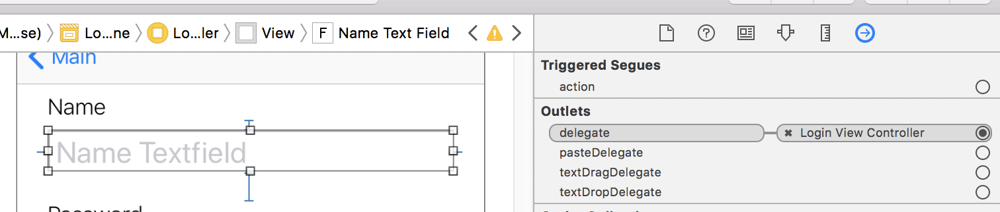
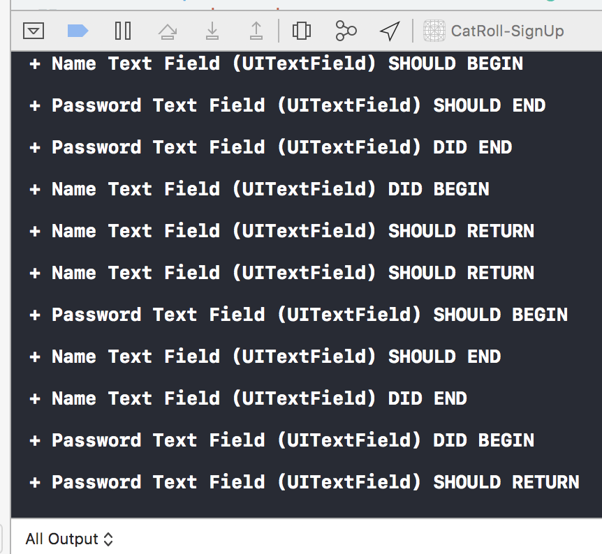
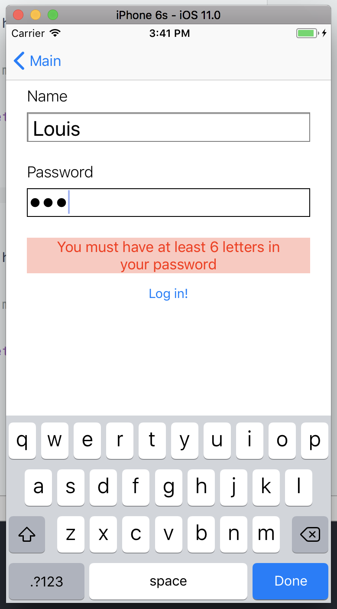

# AC3.2 Delegation through Textfields

---
### Readings

1. [`UITextField` - Apple Doc Ref ](https://developer.apple.com/reference/uikit/uitextfield)
2. [`UITextFieldDelegate` - Apple Doc Ref ](https://developer.apple.com/reference/uikit/uitextfielddelegate)
3. [Adding Connections from UI Elements in Storyboard (Action) - Xcode Doc](http://help.apple.com/xcode/mac/8.0/#/dev9662c7670)
4. [Managing/Checking Outlet Connections - Xcode doc](http://help.apple.com/xcode/mac/8.0/#/devc0cdc8c7a)
5. [String Manipulation Cheat Sheet - Use Your Loaf](http://useyourloaf.com/blog/swift-string-cheat-sheet/)
6. [Complete List of Unicode Categories - File Format](http://www.fileformat.info/info/unicode/category/index.htm)

#### Further Reading

1. [How Delegation Works - Andrew Bancroft](https://www.andrewcbancroft.com/2015/04/08/how-delegation-works-a-swift-developer-guide/)

---
### Vocabulary

1. **Delegate**: ... pattern in which one object in a program acts on behalf of, or in coordination with, another object. The delegating object keeps a reference to the other object—the delegate—and at the appropriate time sends a message to it. The message informs the delegate of an event that the delegating object is about to handle or has just handled. [Apple](https://developer.apple.com/library/content/documentation/General/Conceptual/DevPedia-CocoaCore/Delegation.html)
2. **Refactoring**: ... the process of restructuring existing computer code ... without changing its external behavior... Advantages include improved code readability and reduced complexity. [Wiki](https://en.wikipedia.org/wiki/Code_refactoring)
3. **(Data) Validation**: ...the process of ensuring that a program operates on clean, correct and useful data. It uses routines, often called "validation rules", "validation constraints" or "check routines", that check for correctness, meaningfulness, and security of data that are input to the system. [Wiki](https://en.wikipedia.org/wiki/Data_validation)

---
### 0. Objectives

1. Begin to understand the protocols and the delegate design pattern in programming
2. Practice handling delegation using `UITextField` and `UITextFieldDelegate`
3. Explore `String` through textfield validations

---
### 1. Delegation - Wha-huh?

Imagine a job posting for a personal assistant by some employer:

> **Help Wanted:**
>
> **Seeking**: Personal Assistant
>
> **Needed Skills**: Organizing Calendar, Taking Calls, Running Errands

The employer looking for an assistant is likely busy with other things, so much so that they don't have time to *organize their calendar*, or *take all their calls*, or *run errands*. But, they're willing to delegate out some of their responsibilities to their assistant. The employer doesn't really have preference for how their assistant does these tasks - they're only concerned that the tasks get done. And once something gets done, they only want to be informed by their assistant.

Think of a `protocol` as a job posting looking for certain skills:

```swift

// "job posting" PersonalAssistant
protocol PersonalAssistant {
  func organizeCalendar()
  func takeCalls() -> Bool
  func runErrands()
}

```

The employer doesn't necessarily care who they're hiring, just that they can do the functions required. So, a human that could do those tasks would be as valuable to them as a robot, or cat, or dolphin.

A class/struct/enum that is qualified to be a `PersonalAssistant` does their functions on behalf of their "employer." Their "employer" has delegated out some of their duties, and really is only concerned that they happened. When an object is "qualified" to be a `PersonalAssistant`, it is said that they "**conform**" to the `PersonalAssistant protocol`.

#### The `Employer`

To continue the analogy, let's create a class called `Employer`. This `Employer` will have a property called `delegate` of type `PersonalAssistant?`. Why optional? Well, the `Employer` doesn't necessarily have a `PersonalAssistant` right off the bat -- they may need to "hire" one. For that, we'll add a function called `hirePersonalAssistant`. Lastly, the `Employer` needs to be able to declare that they are busy at a meeting and can't take any calls.

```swift
  class Employer {
    // 1. this is optional because we may have not yet "hired" an assistant
    var delegate: PersonalAssistant?

    // 2. We can hire a new assistant
    func hirePersonalAssistant(assistant: PersonalAssistant) {
      self.delegate = assistant
    }

    // 3. Employer is going to a meeting, so their calls need to be handled somehow
    func busyAtAMeeting() {
      if self.delegate?.takeCalls() {
        print("Delegate is taking the call")
      }
      else {
        print("Calls going to voicemail")
      }
    }
  }
```

#### The `Employee: PersonalAssistant`

On the other side of things, we have an `Employee` class. The `Employee` is interested in applying to be a `PersonalAssistant`, which means that they can guarantee that they can fulfill the required tasks of `organizeCalendar()`, `takeCalls()`, and `runErrands`.

```swift
  // This Employee conforms to the PersonalAssistant protocol
  class Employee: PersonalAssistant {

    // 1. This employee has an additional ability outside of the requirements of the job description (being able to greeting people)
    func greet() {
        print("Hi there, I'm your Personal Assistant")
    }

    // 2. But because Employee conforms to the PersonalAssistant protocol/job description,
    //    its required skills are to organizeCalendar, takeCalls, and runErrands
    func organizeCalendar() {
      print("Organizing your calendar")
    }

    func takeCalls() -> Bool {
      print("Answering calls")
      return true
    }
    func runErrands() {
        print("Off running some errands")
    }
  }
```

#### First Day on the Job

To see delegation in action, we could imagine `Employee`'s first day on the job looking like this:

```swift

// 8am, Employer gets into work. An Employee is coming in at 9am for an interview
let boss = Employer()

// 8:30am, boss has a meeting to go to
boss.busyAtAMeeting() // prints "Calls going to voicemail"

// 9am. Employee arrives for the interview to be a PersonalAssistant
let assistant = Employee()
assistant.greet() // prints "Hi there, I'm your Personal Assistant" ... boss thinks this is a little too soon, they haven't gotten the job yet... 🤦‍♂️

// 10am. boss is so impressed by the new assistant! hires them right on the spot❗❗❗ 💰
boss.hirePersonalAssistant(assistant)

// 11am. boss heads into another meeting. but now has an assistant!
boss.busyAtAMeeting()   // assistant prints "Answering calls"
                        // boss prints "Delegate is taking the call"

// 12am. boss and assistant take lunch and bond 🤝
```

---
### 2. Storyboard Setup

Now that we know a little more about the concept behind protocols and delegation, let's start to build out the project. Keep in mind the examples just covered as we go through and talk about `UITextfield`.

#### Project Starters:

> Note: You are provided 3 `UIViewController` subclasses in the project already:`MainViewController`, `LoginViewController`, `SignupViewController`
>
> In your `Main.storyboard`, there will be a `MainViewController` with `UINavigationController` already embedded

1. Add two buttons to `MainViewController`
    - Label them `Login` and `Signup`
    - Select both of them (by holding `CMD` while clicking on them), and embed them in a `UIStackViewController`
        - This is done the same as how you would embed in a navigation controller, `Editor > Embed In > StackView`)
    - With the **stack view** selected, add 2 constraints: `centerY` and `centerX` to place it in the center of the view
    - 
2. Drag in two more view controllers into storyboard
    - Add a `show` segue with the identifier `loginSegue` from the `Login` button to one of the VC's. Change this VC's class to `LoginViewController`.
    - Add a `show` segue with the identifier `signupSegue` from the `Signup` button to the other VC. Change this VC to `SignupViewController`
    - Run project and make sure navigation is working
    - 

Run the project now and make sure you can navigate between the main view controller and both the login and signup controllers.

#### Challenge:

A core skill for any iOS developer is being able to look at a mock up and translating it into code and/or a storyboard. If you feel up to it, take a look at the following images and try to get as far as you can in your design in storyboard. If you get stuck, or think you've finished, go ahead and double check your work by following the instructions in the next section.

> Note: Somethings you will just not be able to tell from just an image alone. For example, from the image we probably wouldn't be able to tell that the password field should hide the text in it as a user types in their password. As developers, we can only make so many assumptions about what a design indicates.

#### Storyboard


#### Running in Simulator


---
### 3. Full Login Storyboard Setup (*spoilers!*)

3. To the `LoginViewController`, add a `UILabel` and a `UITextField` just below it.
    - Set their margins to `8pt` on top, left and right, making sure to check "relative to margins"
    - Label the label as `Name`, `18 - pt, System Light`
    - Label the textfield as `Name Text Field`, `24 - pt`
4. Add another set of `UILabel` and `UITextField` below them.
    - Set the top of this `UILabel` to `24pt`, and it's left & right to `8pt`
    - Set the margins of `UITextField` to `8pt` for top, left and right, making sure to check "relative to margins"
    - Label the `UILabel` as `Password`, `18 - pt, System Light`
    - Label the `UITextField` as `Password Text Field`, `24 pt`
5. Change the following properties of the `Name Text Field`:
    - `borderStyle`: `bezel` (usually for text entry fields)
    - `placeholder`: "name" (what appears in the text field before you tap in it to add text, its usually light gray text)
    - `capitilization`: `Words` (auto capitalizes first letter of each word)
    - `correction`: no
    - `spellChecking`: no (we don't want autocorrect for people's names)
    - `returnKey`: `next` (changes the text of the return key)
    - `Automatically Enable Return Key` : make sure this unchecked (enabling this makes the return key disabled until at least one character is present, feel free to run the simulator before and after changing this to see what happens)
    - In the "Identity Inspector", make sure "Accessibility" is enabled, and give it a `Label` of `Name Text Field`
6. Change the following properties of `Password Text Field`:
    - `borderStyle`: `bezel` (usually for text entry fields)
    - `placeholder`: "password address"
    - `capitilization`: `None`
    - `correction`: no,
    - `spellChecking`: no
    - `returnKey` : `Done`
    - `secureTextEntry` : `yes` (shows bulletpoints instead of letters when typing)
    - `Automatically Enable Return Key` : make sure this unchecked
    - In the "Identity Inspector", make sure "Accessibility" is enabled, and give it a `Label` of `Password Text Field`
7. Below `Password Text Field`, drag in another label
    - `24pt` from top, `8pt` from left and right, `centerX` text-aligned
    - Label it `Error Label`
        - text color Red
        - background color Red with an opacity of 25%
        - number of lines = 0
        - `17pt, System - Bold`
        - Set the label to be hidden
        - 
8. Below `Error Label`, add a button, `loginButton`
    - `8pt` top margin from `Error Label`, `centerX` aligned
    - Change text to say `Log in!`
9. Create the following outlets and actions for this `LoginViewController`:
    - outlets: `nameTextField`, `passwordTextField`, `errorLabel`
    - actions: `didTapLogin(sender:)` (set the sender type to `UIButton`, NOT `AnyObject`)
    - delegate outlets: Crtl+drag from both textfields to the `LoginViewController`, in the outlets menu that pops up, select `delegate` (this is how you set up delegation through storyboard)
10. In `LoginViewController.swift`, set the class to be a `UITextFieldDelegate`
    - All text field delegate functions are optional, so you won't get any warnings/errors
11. Run the project at this point, it should look like:

#### Storyboard


#### Running in Simulator


---
### 4. A Single `delegate` for Many "Employers"

You can imagine a `UITextField` as an `Employer` that's on the hunt for an `Employee` that can handle some `delegate`d work. A `UITextField`'s delegate handles many aspects of a user's interaction with the `UITextField`. If we turned `UITextFieldDelegate` into a job description, we would end up with something like:

```
Job Posting: UITextfieldDelegate
Qualifications:

- textFieldShouldBeginEditing,
- textFieldDidBeginEditing,
- textFieldShouldEndEditing,
- etc.

Employer: UITextfield
```

But because a `UITextFieldDelegate` can be a delegate for many `UITextField`s at once, it has a parameter in its protocol functions to identify which `UITextField` has delegated out a task.

The analogy for the `PersonalAssistant` would be that the assistant could work for multiple bosses at once, so we could re-write the protocol functions to include a parameter to let the assistant know which one of their bosses requires help:

```swift
  protocol PersonalAssistant {
    func organizeCalendar(for employer: Employer)
    func takeCalls(for employer: Employer) -> Bool
    func runErrands(for employer: Employer)
  }

  class Employee: Personal Assistant {
    func organizeCalendar(for employer: Employer) {
      if employer.name == "Jon Snow" {
        print("Organizing your calendar, Lord Commander")
      }

       if employer.name == "Daenerys Targaryen" {
        print("Organizing your calendar, Khalessi")
      }
    }
    // etc...
  }
```

Including the owning object (the `Employer`) as a parameter in the protocol's function is a common pattern in iOS delegation, and you will see it very often. For example, looking at the functions for a [`UITableViewDelegate`](https://developer.apple.com/documentation/uikit/uitableviewdelegate#), we notice that they each have a parameter of `tableView: UITableView` corresponding to the table that is alerting the delegate (there *could* be multiple, eventhough we have only ever used one so far). The other parameters in delegate functions are related to the "task" that particular function is meant to do. `UITextFieldDelegate` follows this pattern as well, and if you browse the class's [documentation](https://developer.apple.com/documentation/uikit/uitextfielddelegate), you'll see that the function each get passed a parameter of type `UITextField`.

With all that in mind let's look at one particular delegate function, `textField(shouldChangeCharactersIn:replacementString:)` which is responsible for deciding whether or not text can be added or deleted from a `UITextField`. Commonly this delegate function is used in pattern checking for text fields. For example, an app's password text field may only want to accept alphanumeric characters, and inputing a punctuation symbol, like a period or dash, shouldn't be allowed.

From the Apple Doc for `textField(shouldChangeCharactersIn:replacementString:)`:

> `replacementString string: String` The replacement string for the specified range. During typing, this parameter normally contains only the single new character that was typed, but it may contain more characters if the user is pasting text. When the user deletes one or more characters, the replacement string is empty.

Now, using what we know of this protocol function along with our testing of the other `UITextFieldDelegate` functions, let's do a basic login form with validation (something that is extremely common).

---
### 3. Text Field Delegation

> Note: Make sure that you've added delegate outlets for each of `UITextField` in `LoginViewController` as described in the earlier setup. You can verify this by selecting the textfield in storyboard and then opening the **Connections Inspector** panel on the right. 

1. Declare that `LoginViewController` will conform to the `UITextfieldDelegate` protocol:
    - `class LoginViewController: UIViewController, UITextFieldDelegate`
1. Add in the following `UITextFieldDelegate` functions to `LoginViewController` (note: as you start typing the word `text` you should see a number of options to autocomplete):
    - `textFieldShouldBeginEditing`
    - `textFieldDidBeginEditing`
    - `textFieldShouldEndEditing`
    - `textFieldDidEndEditing`
    - `textFieldShouldReturn`
2. In each of these functions, add a print statement such as the one below (and `return true` where appropriate) so that your code looks something like:

```swift
    // the .debugId property is defined in an extension, it's not actually part of UITextField
    // it has been added to better illustrate how each of these functions get called from each
    // of the two textfields we have in the LoginViewController
    func textFieldShouldBeginEditing(_ textField: UITextField) -> Bool {
        print("\n + \(textField.debugId) SHOULD BEGIN")
        return true
    }

    func textFieldDidBeginEditing(_ textField: UITextField) {
        print("\n + \(textField.debugId) DID BEGIN")
    }

    func textFieldShouldEndEditing(_ textField: UITextField) -> Bool {
        print("\n + \(textField.debugId) SHOULD END")
        return true
    }

    func textFieldDidEndEditing(_ textField: UITextField) {
        print("\n + \(textField.debugId) DID END")
    }

    func textFieldShouldReturn(_ textField: UITextField) -> Bool {
        print("\n + \(textField.debugId) SHOULD RETURN")
        return true
    }
```
Run the project again, and tap the textFields and observe the output to console. Trying typing something in and hitting the "Return" key.
    - Experiment with changing the `return true` to `false` for `shouldEndEditing` and `shouldBeginEditing` and see how that affects the textFields



> *Developer's Note*: Anytime we try out something new, **experiment with it!!** The best way to learn coding is by playing around with code to see what happens. Eventhough instructions are laid out in detail, this lesson is no exception . You should feel free to Google questions to you have or just try adding some custom code the the scaffold this lesson builds. If you break something 💔, good! Learn to fix it 🔨😉❤️

----
### 4. Text Validation through `UITextFieldDelegate`

The most basic of validation is checking to make sure that something has been entered at all in the text fields. With respect the password field, we also probably want to set a minimum length on the password.

#### Warm-up Exercises

1. Let's add in a simple validation function that takes in a textfield and `Int` of a minimum character count, and returns a `Bool` based on whether or not the length of the string is greater than the minimum. *(Use the provided tests to guide your code for this exercise!!!)*
2. With this new function, we now need to add some code into `shouldReturn` to add in the validation. Your task is to add code to `textFieldShouldReturn` that:
    - Checks which `textField` is passed into the delegate function
    - Uses `textField(_:hasMinimumCharacters:)` to check if the text fields meet a minimum requirement. Let's have `nameTextField` require 4 characters and `passwordTextField` require 6.
    - If a `textField` doesn't meet the minimum required characters, you should display a relevant error message in `errorLabel` and `return false`
    - If the validation passes, we should clear out the `errorLabel` so as not to confuse users

<br>
<details><summary>Hint 1: Visibility?</summary>
<br><br>
Some property of <code>errorLabel</code> may make it impossible to see until changed...
<br><br>
</details>
<br>

<details><summary>Hint 2: When is <code>textFieldShouldReturn</code> called?</summary>
<br><br>
You'll need to determine this in order to make sure the code works. Do some searching!
<br><br>
</details>
<br>

```swift
    // You can use the comments below, along with your tests, to help guide you
    func textFieldShouldReturn(_ textField: UITextField) -> Bool {
        print("\n ~ \(textField.debugId) SHOULD RETURN")

        // 1. Check for which textField is passed

        // 2. Check if it has the minimum required length
        //  - 4 for nameTextField
        //  - 6 for passwordTextField

        // 3. If not long enough, display error message in errorLabel
        // 4. If long enough, clear error message in errorLabel

        return true
    }
```

If you've implemented the code correctly, you should see something like this when trying to return on a password that isn't long enough:




> Discuss: What should happen in the current logic if you don't meet either criteria? Meaning what will the error label display if both the name and password fields didn't meet the requirements?)


Great that this works, but the validation only gets called on tapping the return key. We'd probably like it if it happened when the user also tapped the `Login` button. Because we're looking for the exact same functionality *(validation)* to occur from multiple actions *(either tapping the "return" key or Login button)*, we know that this would be a good time to create a separate function for the task so we don't need to write the same validation code in two places.

Let's create a function that we can call from anywhere when we'd like to do a final validation of the textFields. Keep in mind that because our form has multiple text fields, and each text field will have different validation requirements, we'll need know which textfield is which in order to make sure we do the correct validation and display the proper errors.

```swift
    // MARK: - Validations
    func textFieldsAreValid() -> Bool {

        // 1. some set up
        let textFields: [UITextField] = [self.nameTextField, self.passwordTextField]
        let minimumLengthRequireMents: [UITextField : Int] = [
            self.nameTextField : 4,
            self.passwordTextField : 6
        ]

        // 2. iterrate over the text fields

        // 3. check if the textfield doesn't have the minimum required characters

        // 4. make sure that the label isn't hidden

        // 5. display an error to the user in the errorLabel

        // 6. return a Bool to indicate that the fields are not valid

        // 7. hide the error label if all gets validated

        // 8. indicate that the fields are invalid
        return true
    }
```

#### Cleaning Up/Refactoring

Now with `textFieldsAreValid` in place, we can remove all of our previous code from `shouldReturn` and replace it with just:

```swift
    func textFieldShouldReturn(_ textField: UITextField) -> Bool {
        print("\n + \(textField.debugId) SHOULD RETURN")
        return self.textFieldsAreValid()
    }
```

Additionally, in the `IBAction` we set up for the `loginButton`,`didTapLogin` we could call the same function so that we can valid not only on return, but on pressing `Login`!:

```swift
    // MARK: - Actions
    @IBAction func didTapLogin(_ sender: UIButton) {
        print("Tapped Login")
        self.textFieldsAreValid()
    }
```

> Note: Swift will give you a warning about "Result of call to 'textFieldsAreValid()" is unused. This is because by default, there is a setting in "Build Settings" for projects that automatically generates these warnings. You can silence these in two ways:
> 1. Add `@discardableResult` just before the `func` keyword of a function or
> 2. Assigning the return value to `_` (as in `_ = self.textFieldsAreValid()`)

> Developer's Note: Take another moment to think about why it was valuable here to move code that would perform the same task out into its own function. You may be wondering why we couldn't simply copy-paste the code into each part.
>
> Well, you *could* do that and that would work... now. But if you needed to make *any* changes to that code you copied, you'd have to make it **EVERYWHERE** you copied it. And because we're human, there's a good chance we're not going to remember *every* place that code needs to be changed. And so, we've introduced to potential for nasty bugs.


---
### 5. Live Validation

As previously mentioned, we can also do "live" validation. Meaning, the user receives feedback about what they're typing as they type rather than when finally hitting `return` or the `login` button.

#### Exercise:

1. This process of live validation is commonly done in `shouldChangeCharacters`. Let's add a validation to the `nameTextField` making sure that users can only type in letters. But because we're probably going to want to do something similar to the password textfield, let's create a separate function in `LoginViewController` that will allow use to reuse code *and* unit test.

```swift
    func string(_ string: String, containsOnly characterSet: CharacterSet) -> Bool {
        // check for character membership in string

        return true
    }
```

Once you're done writing and testing the code, update `shouldChangeCharacters` to make use of the new function

```swift
  func textField(_ textField: UITextField, shouldChangeCharactersIn range: NSRange, replacementString string: String) -> Bool {

        // only interested in doing this validation for self.nameTextField
        // and per documentation, string can be empty if the change is a deletion
        if textField == self.nameTextField && string != "" {
            return self.string(string, containsOnly: CharacterSet.letters.union(CharacterSet.whitespaces))
        }

        return true
    }

```

<br>
<details><summary>Hint 1: Work with the <code>String</code></summary>
<br><br>
You're going to want to use <code>rangeOfCharacter(from:)</code> if you're using Swift 3.x
<br><br>
</details>
<br>

<br>
<details><summary>Hint 2: CharacterSets</summary>
<br><br>
Check out the documentation for <code>CharacterSet</code>, you'll find it incredibly useful for this exercise.
<br><br>
</details>
<br>

---


2. Run your project and test your validation method. You should now only be able to type letters in the name text field. Trying to type a number should result in nothing appearing. The last part of this is to alert the user to the error. Go ahead and update the `errorLabel` with some text to let the user know the error (and also be sure to clear the label when a valid character is typed!)

To help you out, use this helper function to update your `errorLabel` (and replace where appropriate in your code). Make sure you can read and understand what the function is doing.

```swift
    func updateErrorLabel(with message: String? = nil) {
        if message == nil {
            self.errorLabel.isHidden = true
        }

        if self.errorLabel.isHidden {
            self.errorLabel.isHidden = false
        }

        self.errorLabel.text = message
        self.errorLabel.textColor = UIColor.red
        self.errorLabel.backgroundColor = UIColor.red.withAlphaComponent(0.25)
    }
```

---
### 6. More Exercises 🏋️‍♂️

> Be sure to go into uncomment the indicated code in `CatRoll_SignUpTests.swift` before beginning the exercises. All of your code should pass the tests in place. Take a look at the tests to know what to name your functions and to guide you on what they should be able to do.

This is a good start, but we should add a few more validations to our login form:

1. The name field should have a first **and** last name. Do a validation to make sure there are at least 2 words in the name text field. Additionally, make sure to `trim` any leading & trailing white space characters.

<br>
<details><summary>Hint 1: Where to Add This Code?</summary>
<br><br>
This is probably best written using a function you create that's called in <code>textFieldsAreValid</code>. There are a number of valid ways to go about this, such as using <code>split, first, indexOf, etc.</code>
<br><br>
</details>
<br>

<br>
<details><summary>Hint 2: More Character Checks</summary>
<br><br>
    You will need to update the live validation for the <code>nameTextField</code> to allow for more than just <code>CharacterSet.letters</code> (use the tests to figure out which character sets you should be allowing). Be sure to update the error message to be accurate as well
<br><br>
</details>
<br>

2. We'd like for passwords to be "strong", so let's make sure that users also include *at least* one number in addition to the 6 character minimum

3. Ok, this should be *a little* stronger, so make sure there's also at least 1 capitalized letter

4. Our servers that are going to store a user's name and password are kind of old and don't like non-alphanumeric characters being used. Do a live validation of the password text field to make sure users aren't typing characters other than numbers and letters.

