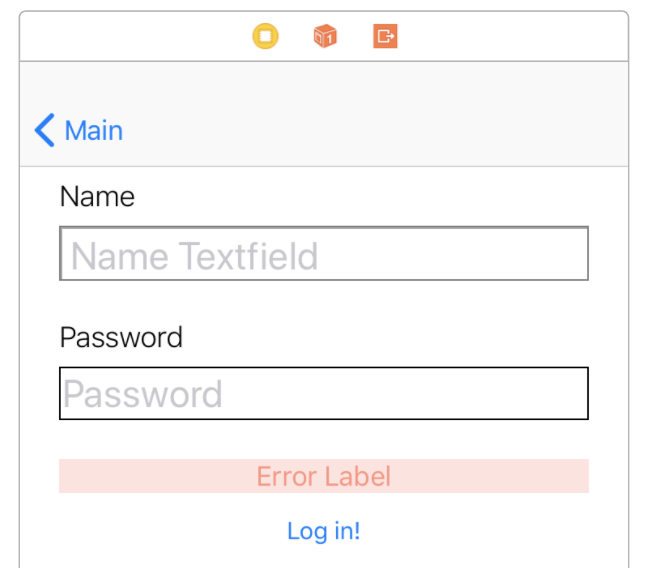
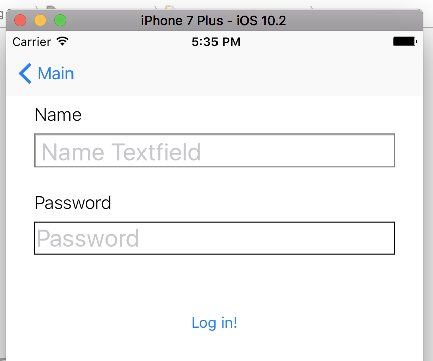
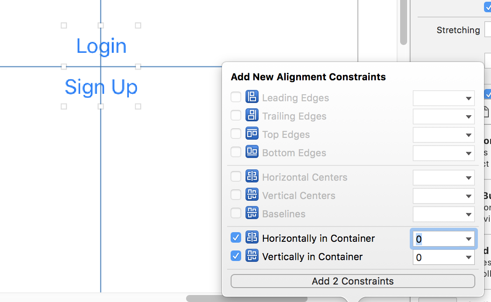
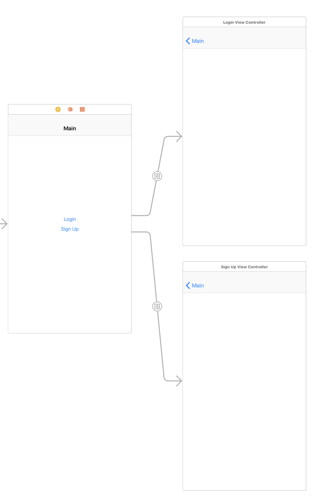
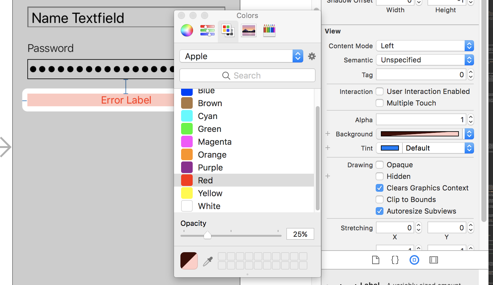

### AC3.2 Delegation through Textfields

---
### Readings

1. [`UITextField` - Apple Doc Ref ](https://developer.apple.com/reference/uikit/uitextfield)
2. [`UITextFieldDelegate` - Apple Doc Ref ](https://developer.apple.com/reference/uikit/uitextfielddelegate)
3. [Adding Connections from UI Elements in Storyboard (Action) - Xcode Doc](http://help.apple.com/xcode/mac/8.0/#/dev9662c7670)
4. [Managing/Checking Outlet Connections - Xcode doc](http://help.apple.com/xcode/mac/8.0/#/devc0cdc8c7a)
5. [String Manipulation Cheat Sheet - Use Your Loaf](http://useyourloaf.com/blog/swift-string-cheat-sheet/)
6. [Complete List of Unicode Categories - File Format](http://www.fileformat.info/info/unicode/category/index.htm)

#### Further Reading

1. [How Delegation Works - Andrew Bancroft](https://www.andrewcbancroft.com/2015/04/08/how-delegation-works-a-swift-developer-guide/)

---
### Vocabulary

1. **Delegate**: dafjsdfd

---
### 0. Objectives

1. Begin to understand the delegation pattern in programming

---
### 1. Delegation - Wha-huh?

Imagine a job posting for a personal assistant by some employer:

> **Seeking**: Personal Assistant
> **Needed Skills**: Organizing Calendar, Taking Calls, Running Errands

The employer looking for and assistant is likely busy with other things, so much so that they don't have time to *organize their calendar*, or *take all their calls*, or *run errands*. But, they're willing to delegate out some of their responsibilities to their assistant. The employer doesn't really have preference for how their assistant does these tasks - they're only concerned that the tasks get done. And once something gets done, they only want to be informed by their assistant.

Think of a `protocol` as a job posting looking for certain skills:

```swift

// "job posting" PersonalAssistant
protocol PersonalAssistant {
  func organizeCalendar()
  func takeCalls() -> Bool
  func runErrands()
}

```

The employer doesn't necessarily care who they're hiring, just that they can do the functions required. So, a human that could do those tasks would be as valuable to them as a robot, or cat, or dolphin.

A class/struct/enum that is qualified to be a `PersonalAssistant` does their functions on behalf of their "employer." Their "employer" has delegated out some of their duties, and really is only concerned that they happened. When an object is "qualified" to be a `PersonalAssistant`, it is said that they "**conform**" to the `PersonalAssistant protocol`.

#### The `Employer`

To continue the analogy, let's create a class called `Employer`. This `Employer` will have a property called `delegate` of type `PersonalAssistant?`. Why optional? Well, the `Employer` doesn't necessarily have a `PersonalAssistant` right off the bat -- they may need to "hire" one. For that, we'll add a function called `hirePersonalAssistant`. Lastly, the `Employer` needs to be able to declare that they are busy at a meeting and can't take any calls.

```swift
  class Employer {
    // 1. this is optional because we may have not yet "hired" an assistant
    var delegate: PersonalAssistant?

    // 2. We can hire a new assistant
    func hirePersonalAssistant(assistant: PersonalAssistant) {
      self.delegate = assistant
    }

    // 3. Employer is going to a meeting, so their calls need to be handled somehow
    func busyAtAMeeting() {
      if self.delegate?.takeCalls() {
        print("Delegate is taking the call")
      }
      else {
        print("Calls going to voicemail")
      }
    }
  }
```

#### The `Employee: PersonalAssistant`

On the other side of things, we have an `Employee` class. The `Employee` is interested in applying to be a `PersonalAssistant`, so they can guarantee that they can fulfill the required tasks of `organizeCalendar()`, `takeCalls()`, and `runErrands`.

```swift
  // This Employee conforms to the PersonalAssistant protocol
  class Employee: PersonalAssistant {

    // 1. This employee has an additional ability, greeting people
    func greet() {
        print("Hi there, I'm your Personal Assistant")
    }

    // 2. But because Employee conforms to the PersonalAssistant protocol/job description, one of its required skills is to organizeCalendar
    func organizeCalendar() {
      print("Organizing your calendar")
    }

    // 3. Additionally, the employee needs to guarantee that they can take calls and let their employer know about it
    func takeCalls() -> Bool {
      print("Answering calls")
      return true
    }

    // 4. And lastly, the employee can runErrands
    func runErrands() {
        print("Off running some errands")
    }
  }
```

#### First Day on the Job

We could imagine the first day on the job looking like this:

```swift

// 8am, Employer gets into work. An Employee is coming in at 9am for an interview
let boss = Employer()

// 8:30a, boss has a meeting to go to
boss.busyAtAMeeting() // prints "Calls going to voicemail"

// 9a. Employee arrives for the interview to be a PersonalAssistant
let assistant = Employee()
assistant.greet() // prints "Hi there, I'm your Personal Assistant" ... boss thinks this is a little too soon, they haven't gotten the job yet... 🤦‍♂️

// 10a. boss is so impressed by the new assistant! hires them right on the spot❗❗❗ 💰
boss.hirePersonalAssistant(assistant)

// 11a. boss heads into another meeting. but now has an assistant!
boss.busyAtAMeeting()   // assistant prints "Answering calls"
                        // boss prints "Delegate is taking the call"

// 12a. boss and assistant take lunch and bond 🤝
```

---


In the case of `UITextField`, the `UITextField` is the employer that is delegating certain actions to it's `UITextFieldDelegate`. It's delegate is responsible for responding to those actions as needed. But because a `UITextFieldDelegate` can be a delegate for many `UITextField`s at once, it has a parameter in its protocol functions to identify which `UITextField` has delegated out a task.

The analogy for the `PersonalAssistant` would be that the assistant could work for multiple employers at once, so we could re-write the protocol like:

```swift
  protocol PersonalAssistant {
    func organizeCalendar(for employer: Employer)
    func takeCalls(for employer: Employer)
    func runErrands(for employer: Employer)
  }

  class Employee: Personal Assistant {

    func organizeCalendar(for employer: Employer) {
      if employer.name == "Jon Snow" {
        print("Organizing your calendar, Lord Commander")
      }

       if employer.name == "Daenerys Targaryen" {
        print("Organizing your calendar, Khalessi")
      }
    }

    // etc...
  }
```

This is a common pattern in delegation, and you will see it often (as you have with the `UITextFieldDelegate`, `UITableViewDelegate` and `UITableViewDataSource`). The other parameters in delegate functions are related to the "task" that particular function is meant to do. With that in mind, let's look at `textField(shouldChangeCharactersIn:replacementString:)`

#### `textField(_ textField: UITextField, shouldChangeCharactersIn range: NSRange, replacementString string: String) -> Bool`
This delegate function is often used in pattern checking for text fields. For example, an app's password text field may only want to accept alphanumeric characters, and inputing a period or dash shouldn't be allowed. From the Apple Doc:

> `replacementString string: String` The replacement string for the specified range. During typing, this parameter normally contains only the single new character that was typed, but it may contain more characters if the user is pasting text. When the user deletes one or more characters, the replacement string is empty.

Now, using what we know of this protocol function along with our testing of the other `UITextFieldDelegate` functions, let's do a basic login form with validation (something that is extremely common).

---
### 1. Storyboard Setup


#### Orienting Yourself:

- You are provided 3 `UIViewController` subclasses in the project already:
    - `MainViewController`, `LoginViewController`, `SignupViewController`
- In your `Main.storyboard`, there will be a `MainViewController` with `UINavigationController` already embedded

#### Challenge:

A core skill for any iOS developer is being able to look at a mock up and translating it into code and/or a storyboard. If you feel up to it, take a look at the following images and try to get as far as you can in your design in storyboard. If you get stuck, or think you've finished, go ahead and double check your work by following the instructions in the next section!

#### Storyboard


#### Running in Simulator


---

#### Deep Dive into the Storyboard:

1. Add two buttons to `MainViewController`
    - Label them `Login` and `Signup`
    - Select both of them (by holding `CMD` while clicking on them), and embed them in a `UIStackViewController`
        - This is done the same as how you would embed in a navigation controller, `Editor > Embed In > StackView`)
    - With the **stack view** selected, add 2 constraints: `centerY` and `centerX` to place it in the center of the view
    - 
2. Drag in two more view controllers into storyboard
    - Add a `show` segue with the identifier `loginSegue` from the `Login` button to one of the VC's. Change this VC's class to `LoginViewController`.
    - Add a `show` segue with the identifier `signupSegue` from the `Signup` button to the other VC. Change this VC to `SignupViewController`
    - Run project and make sure navigation is working
    - 
3. To the `LoginViewController`, add a `UILabel` and a `UITextField` just below it.
    - Set their margins to `8pt` on top, left and right, making sure to check "relative to margins"
    - Label the label as `Name`, `18 - pt, System Light`
    - Label the textfield as `Name Text Field`, `24 - pt`
4. Add another set of `UILabel` and `UITextField` below them.
    - Set the top of this `UILabel` to `24pt`, and it's left & right to `8pt`
    - Set the margins of `UITextField` to `8pt` for top, left and right, making sure to check "relative to margins"
    - Label the `UILabel` as `Password`, `18 - pt, System Light`
    - Label the `UITextField` as `Password Text Field`, `24 pt`
5. Change the following properties of the `Name Text Field`:
    - `borderStyle`: `bezel` (usually for text entry fields)
    - `placeholder`: "name" (what appears in the text field before you tap in it to add text, its usually light gray text)
    - `capitilization`: `Words` (auto capitalizes first letter of each word)
    - `correction`: no
    - `spellChecking`: no (we don't want autocorrect for people's names)
    - `returnKey`: `next` (changes the text of the return key)
    - `Automatically Enable Return Key` : make sure this unchecked (enabling this makes the return key disabled until at least one character is present, feel free to run the simulator before and after changing this to see what happens)
    - In the "Identity Inspector", make sure "Accessibility" is enabled, and give it a `Label` of `Name Text Field`
6. Change the following properties of `Password Text Field`:
    - `borderStyle`: `bezel` (usually for text entry fields)
    - `placeholder`: "password address"
    - `capitilization`: `None`
    - `correction`: no,
    - `spellChecking`: no
    - `returnKey` : `Done`
    - `secureTextEntry` : `yes` (shows bulletpoints instead of letters when typing)
    - `Automatically Enable Return Key` : make sure this unchecked
    - In the "Identity Inspector", make sure "Accessibility" is enabled, and give it a `Label` of `Password Text Field`
7. Below `Password Text Field`, drag in another label
    - `24pt` from top, `8pt` from left and right, `centerX` text-aligned
    - Label it `Error Label`
        - text color Red
        - background color Red with an opacity of 25%
        - number of lines = 0
        - `17pt, System - Bold`
        - Set the label to be hidden
        - 
8. Below `Error Label`, add a button, `loginButton`
    - `8pt` top margin from `Error Label`, `centerX` aligned
    - Change text to say `Log in!`
9. Create the following outlets and actions for this `LoginViewController`:
    - outlets: `nameTextField`, `passwordTextField`, `errorLabel`
    - actions: `didTapLogin(sender:)` (set the sender type to `UIButton`, NOT `AnyObject`)
    - delegate outlets: Crtl+drag from both textfields to the `LoginViewController`, in the outlets menu that pops up, select `delegate` (this is how you set up delegation through storyboard)
10. In `LoginViewController.swift`, set the class to be a `UITextFieldDelegate`
    - All text field delegate functions are optional, so you won't get any warnings/errors
11. Run the project at this point, it should look like:

#### Storyboard


#### Running in Simulator


---
### 2. Text Field Delegation

1. Add in the following `UITextFieldDelegate` functions:
    - `textFieldShouldBeginEditing`
    - `textFieldDidBeginEditing`
    - `textFieldShouldEndEditing`
    - `textFieldDidEndEditing`
    - `textFieldShouldReturn`
2. In each of these functions, add a print statement such as the one below (and `return true` where appropriate):
    ```swift
        func textFieldShouldBeginEditing(_ textField: UITextField) -> Bool {
            // the .debugId property is defined in an extension, it's not actually part of UITextField
            print("\n + \(textField.debugId) SHOULD BEGIN") // replace this with the function shorthand
            return true
        }
    ```
3. Run the project again, and tap the textFields and observe the output to console. Trying typing something in and hitting the "Return" key.
    - Experiment with changing the `return true` to `false` for `shouldEndEditing` and `shouldBeginEditing` and see how that affects the textFields

----
### 3. Validation through `UITextFieldDelegate`

The most basic of validation is checking to make sure that something has been entered at all in the text fields. With respect the password field, we also probably want to set a minimum length on the password.

Let's add in a validation function that takes in a textfield and `Int` of a minimum character count, and returns a `Bool` based on whether or not the length of the string is greater than the minimum.
```swift
func textField(_ textField: UITextField, hasMinimumCharacters minimum: Int) -> Bool {
  // fill in code
}
```

Now, let's do some validation in `shouldReturn`:

```swift
    func textFieldShouldReturn(_ textField: UITextField) -> Bool {
        print("\n ~ \(textField.debugId) SHOULD RETURN")

        if textField == self.nameTextField {
            let textIsLongEnough: Bool = self.textField(textField, hasMinimumCharacters: 1)

            // write in code to handle this case
            // 1. check the Bool value, if false, write some error message to the errorLabel
        }

        if textField == self.passwordTextField {
            let textIsLongEnough: Bool = self.textField(textField, hasMinimumCharacters: 6)

            // write in code to handle this case
            // 1. check the Bool value, if false, write some error message to the errorLabel
        }

        return true
    }
```

You should see something like this, if you type in your name and then a 4-letter password and hit the "Return" key (also make sure that you can see the error if you rmove your name but have a 6 letter pass. What should happen in the current logic if you don't meet either criteria? What will the error label display?):


Great that this works, but the validation only gets called on tapping the return key. We'd probably like it if it happened when the user also tapped the `Login` button. Let's create a new function that we can call from anywhere when we'd like to do a final validation of the textFields:

```swift
    // MARK: - Validations
    func textFieldsAreValid() -> Bool {

        // 1. some set up
        let textFields: [UITextField] = [self.nameTextField, self.passwordTextField]
        let minimumLengthRequireMents: [UITextField : Int] = [
            self.nameTextField : 1,
            self.passwordTextField : 6
        ]


        // 2. iterrate over the text fields

        // 3. check if the textfield doesn't have the minimum required characters

        // 4. make sure that the label isn't hidden

        // 5. display an error to the user in the errorLabel

        // 6. return a Bool to indicate that the fields are not valid


        // 7. hide the error label if all gets validated

        // 8. indicate that the fields are valid
        return true
    }
```

Now with this function in place, we can remove all of our previous code from `shouldReturn` and replace it with just:

```swift
    func textFieldShouldReturn(_ textField: UITextField) -> Bool {
        print("\n ~ \(textField.debugId) SHOULD RETURN")

        // this will generate a warning about an unused return variable without the "_ = "
        _ = self.textFieldsAreValid()

        return true
    }
```

> Swift will likely give you a warning about "Result of call to 'textFieldsAreValid()" is unused. This is because by default, there is a setting in "Build Settings" for projects that automatically generates these warnings. You can silence these in two ways:

1. Add `@discardableResult` just before the `func` keyword of a function or
2. Assigning the return value to `_` (as in `_ = self.textFieldsAreValid()`)


**And as tempting as it might be, you don't want to change this build setting to `No`**


---
### 4. Live Validation
As previously mentioned, we can also do "live" validation. Meaning, the user receives feedback about what they're typing right away rather than when finally hitting "return" or the `login` button. This kind of check is done in `shouldChangeCharacters`. Let's add a validation to the `nameTextField` making sure that users can only type in letters and spaces.

```swift
    func string(_ string: String, containsOnly characterSet: CharacterSet) -> Bool {
        // check for character membership in string

        return true
    }
```

Now with that in place, let's update `shouldChangeCharacters`:

```swift
  func textField(_ textField: UITextField, shouldChangeCharactersIn range: NSRange, replacementString string: String) -> Bool {

        // only interested in doing this validation for self.nameTextField
        // and per documentation, string can be empty if the change is a deletion

        if textField == self.nameTextField && string != "" {
            return self.string(string, containsOnly: CharacterSet.letters.union(CharacterSet.whitespaces))
        }

        return true
    }

```

Run your project and test your validation method. You should now only be able to type letters in the name text field. Trying to type a number should result in nothing appearing. The last part of this is to alert the user to the error. Go ahead and update the `errorLabel` with some text to let the user know the error (and also be sure to clear the label when a valid character is typed!)

To help you out, use this function to update your `errorLabel` (and replace where appropriate in your code)
```swift
      func updateErrorLabel(with message: String) {
        if self.errorLabel.isHidden {
            self.errorLabel.isHidden = false
        }

        self.errorLabel.text = message
        self.errorLabel.textColor = UIColor.red
        self.errorLabel.backgroundColor = UIColor.red.withAlphaComponent(0.25)
    }
```

---
### 5. Exercise

> Be sure to go into uncomment the indicated code in `CatRoll_SignUpTests.swift` before beginning the exercises. All of your code should pass the tests in place. Take a look at the tests to know what to name your functions and to guide you on what they should be able to do.

This is a good start, but we should add a few more validations to our login form:

1. The name field should have a first _and_ last name. Do a validation to make sure there are at least 2 names in that text field (do our server a favor as well and make sure any leading & trailing white space characters are trimmed)
  2. Tip: This is probably best done using a function you create that's called in `textFieldsAreValid` (there are a number of valid ways to go about this, such as using `split`, `first`, `indexOf`, etc..)
  3. Tip 2: You will need to update the live validation for the `nameTextField` to allow for more than just `CharacterSet.letters` (use the tests to figure out which character sets you should be allowing). Be sure to update the error message to be accurate as well (`self.updateErrorLabel(with: "\(textField.debugId) can only contain letters, punctuation or spaces")`)
3. We'd like for passwords to be "strong", so let's make sure that users also include *at least* one number in addition to the 6 character minimum
4. Ok, this should be *a little* stronger, so make sure there's also at least 1 capitalized letter
4. Our servers that are going to store a user's name and password are kind of old and don't like non-alphanumeric characters being used. Do a live validation of the password text field to make sure users aren't typing characters other than numbers and letters.


